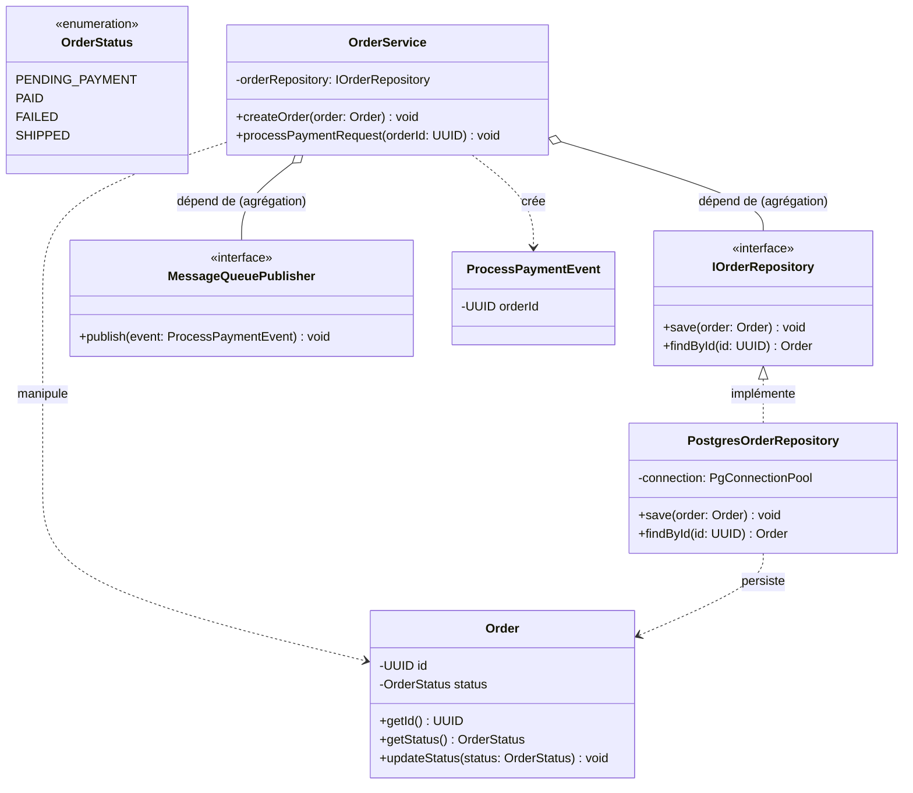

```mermaid
classDiagram
    class OrderStatus {
        <<enumeration>>
        PENDING_PAYMENT
        PAID
        FAILED
        SHIPPED
    }
 
    class Order {
        -UUID id
        -OrderStatus status
        +getId() UUID
        +getStatus() OrderStatus
        +updateStatus(status: OrderStatus) void
    }
 
    class IOrderRepository {
        <<interface>>
        +save(order: Order) void
        +findById(id: UUID) Order
    }
 
    class PostgresOrderRepository {
        -connection: PgConnectionPool
        +save(order: Order) void
        +findById(id: UUID) Order
    }
 
    class OrderService {
        -orderRepository: IOrderRepository
        +createOrder(order: Order) void
        +processPaymentRequest(orderId: UUID) void
    }
 
    class MessageQueuePublisher {
        <<interface>>
        +publish(event: ProcessPaymentEvent) void
    }
 
    class ProcessPaymentEvent {
        -UUID orderId
    }
 
    IOrderRepository <|.. PostgresOrderRepository : implémente
    OrderService o-- IOrderRepository : dépend de (agrégation)
    OrderService ..> Order : manipule
    OrderService o-- MessageQueuePublisher : dépend de (agrégation)
    OrderService ..> ProcessPaymentEvent : crée
    PostgresOrderRepository ..> Order : persiste
```