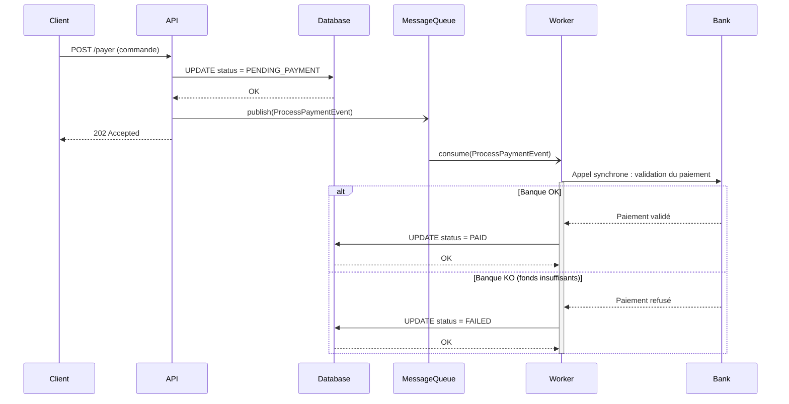

```mermaid
sequenceDiagram
    participant Client
    participant API
    participant Database
    participant MessageQueue
    participant Worker
    participant Bank
 
    Client->>API: POST /payer (commande)
    API->>Database: UPDATE status = PENDING_PAYMENT
    Database-->>API: OK
    API-)MessageQueue: publish(ProcessPaymentEvent)
    API-->>Client: 202 Accepted
 
    MessageQueue-)Worker: consume(ProcessPaymentEvent)
    Worker->>Bank: Appel synchrone : validation du paiement
    activate Worker
 
    alt Banque OK
        Bank-->>Worker: Paiement validé
        Worker->>Database: UPDATE status = PAID
        Database-->>Worker: OK
    else Banque KO (fonds insuffisants)
        Bank-->>Worker: Paiement refusé
        Worker->>Database: UPDATE status = FAILED
        Database-->>Worker: OK
    end
    deactivate Worker
```